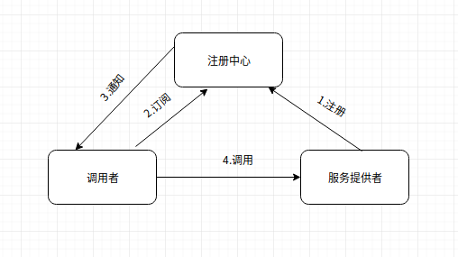

# 初体验

Dubbo是Alibaba开源的分布式RPC框架，目前已经捐赠给了Apache基金会，项目主页是[http://dubbo.apache.org](http://dubbo.apache.org)。Dubbo核心架构中有几个重要的概念，包括注册中心、服务提供者和服务消费者，它们的关系如下图所示。

注册中心作为服务提供者和调用者之间产生关系的桥梁。服务提供者先在注册中心注册它自己的相关信息，主要包括它的地址信息和其它一些配置参数。作为服务的消费者，也就是调用者一方需要从注册中心订阅服务信息，当服务信息发生变化时，注册中心将通知调用者，调用者获取到了服务的信息后就可以直接对服务提供者发起调用了，即调用过程是不需要注册中心的参与。

使用Dubbo时大的方向有两种方式，一种是基于Spring的方式使用，第二种是不依赖于Spring，直接使用Dubbo底层的API编程，这种通常对应于非Spring项目或者是需要很高的灵活性，基于Spring的配置满足不了等。基于Spring进行配置和使用又分基于XML配置和基于注解配置，笔者在这里先介绍基于XML配置的。