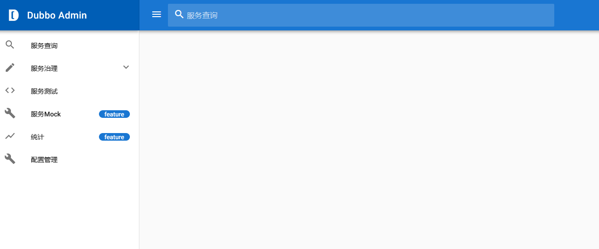

# 控制台

Dubbo提供了一个管理控制台可以对Dubbo服务进行管理。Dubbo管理控制台的Github地址是[https://github.com/apache/dubbo-admin/](https://github.com/apache/dubbo-admin/)。使用控制台时需要从Github上克隆其源代码。

```text
git clone https://github.com/apache/dubbo-admin.git
```

dubbo-admin下包含后端和前端代码，后端代码在dubbo-admin-server下，前端代码在dubbo-admin-ui下。后端是基于Spring Boot开发的，可以在`dubbo-admin-server/src/main/resources/application.properties`中修改相关的配置信息，主要是修改配置中心的信息。

然后可以在dubbo-admin根目录下执行`mvn clean package`进行打包。

然后运行dubbo-admin-server。

```text
mvn --projects dubbo-admin-server spring-boot:run
```

也可以直接运行dubbo-admin-server/target目录下的dubbo-admin-server.jar。

```text
java -jar dubbo-admin-server/target/dubbo-admin-server-0.1.jar
```

dubbo-admin-server启动后默认会监听在端口8080上，可以访问`localhost:8080`查看控制台。




（注：本文是基于Dubbo2.7.2所写）
