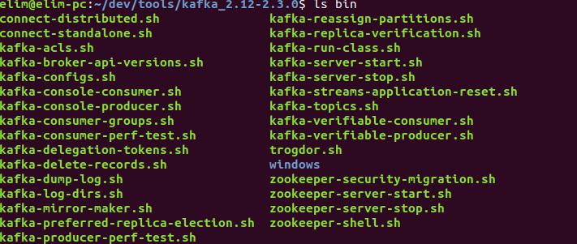

# 简介

Kafka是Apache基金会的一个分布式流平台，也是一个消息队列。官网是[http://kafka.apache.org/](http://kafka.apache.org/)。

## Topic

Kafka的消息通过Topic来进行分类，一条消息只能属于一个Topic。Topic又会分区，一个Topic可以定义1-N个分区，一条消息只会发送到Topic的某一个分区中。每个分区中的消息是有顺序的，同一个生产者发送两条消息到同一个Topic的同一个分区中，M1和M2，那么它们存储在分区中的顺序也是M1、M2，消费的时候也是按照M1、M2的顺序进行消费。


## Cluster

Kafka的服务器是可以有多台的，多台服务器可以组成一个集群。服务器与服务器之间是主从关系，只有主服务器才能提供读写服务。这种主从关系不是针对整个Topic而言的，而是针对的Topic的某个分区。比如一个Topic有4个分区，需要有4个副本，Cluster中有四台机器。那么这四台机器会分别是4个分区的主服务器，剩下的三台是从服务器，这样就确保了每个分区都有4个副本。这也达到了一个负载均衡的效果，将读写请求都分配到了四台机器。它们之间的关系可以用下表来表示。

| 分区 | 主机器 | 从机器 |
| :---: | :-----: | :-----: |
| P1 | S1 | S2/S3/S4 |
| P2 | S2 | S1/S3/S4 |
| P3 | S3 | S1/S2/S4 |
| P4 | S4 | S1/S2/S3 |

主节点负责处理读写请求，而从节点会从主节点复制消息，作为主节点的副本。当主节点挂了后，会重新选举一个从节点作为主节点。比如上面的S1挂了后，分区P1的主节点可能就变成S2了，从节点就是S3/S4。所以对于一个有N台机器，N个副本的Cluster来说，最多允许有N-1台机器宕机。

## Producer

Producer用来发送消息。它在发送消息时也可以选择消息需要发送到哪个Topic的哪个分区。

## Consumer

Consumer用来消费消息，它需要订阅需要消费的消息所属的Topic。Consumer需要指定一个group，一个group下可以有多个Consumer实例，这些实例可以是在一个进程中，也可以是在多个进程中。同一个group的Consumer共享Topic分区中的消息，每一条消息都只能由一个Consumer实例消费。Topic的每一个分区也只能由某一个Consumer实例消费，所以如果Consumer实例多于分区数时，有些Consumer会得不到可消费的分区，也就没有可消费的消息。属于不同group的Consumer之间没有什么关联，当两个Consumer属于不同的group时，它们都可以消费所订阅的Topic的消息，彼此独立。关于Consumer、group和Topic分区的关系可以用下面这张图来表示。


在上面这张图中我们的Topic有四个分区，Kafka集群中有两个节点，节点1负责分区1和4的读写请求，节点2负责分区2和3的读写请求。有两个Consumer group，group A有两个实例，group B有四个实例，group A的两个实例平均分配了四个分区，各得两个，group B与group A是相互独立的，所以它也需要消费上面的四个分区，它有四个实例，平均每个分配到了一个分区。

消息在分区中不会因为消息被Consumer消费了就删除了，它会一直存在于分区中，直到达到了它的过期时间，可以进行配置，比如一天或者两天，默认的配置文件中定义的是7天。当达到了过期时间后对应的消息才会被删除，以此来释放所占用的资源。这样做的好处是消息可以被不同的Consumer进行消费，也可以由同一个Consumer消费多次。Consumer在从分区中消费消息时需要指定从哪里开始消费，这个消费位置是由Consumer进行维护的，所以每个Consumer的消费位置是独立的。下图就描述了它们之间的这种关系。


## 初体验

Kafka目前最新的版本是2.3.0，可以从[https://www.apache.org/dyn/closer.cgi?path=/kafka/2.3.0/kafka_2.12-2.3.0.tgz](https://www.apache.org/dyn/closer.cgi?path=/kafka/2.3.0/kafka_2.12-2.3.0.tgz)下载2.3.0的安装包。解压后在其bin目录下可以看到有一堆的运行程序。



> 如果需要在windows平台运行，则运行`bin/windows`下面的指令。

Kafka的运行需要依赖Zookeeper，它的安装包里面已经包含了一个Zookeeper，可以直接运行安装包里面的Zookeeper。

```text
bin/zookeeper-server-start.sh config/zookeeper.properties
```

> 配置文件都是定义在config目录下的。Zookeeper使用的配置文件是`config/zookeeper.properties`，如果需要调整配置可以在该配置文件中调整，比如调整Zookeeper的监听端口号。

有了Zookeeper后就可以启动Kafka服务了。这需要使用kafka-server-start.sh脚本，然后需要指定`config/server.properties`作为配置文件。可以在配置文件中定义Kafka相关的一些信息，比如Zookeeper连接信息等。

```text
bin/kafka-server-start.sh config/server.properties
```

Kafka服务默认监听9092端口。Kafka服务启动后，为了收发消息，我们需要创建对应的Topic，这需要使用`bin/kafka-topics.sh`。下面的指令就创建了一个名为topic1的Topic，该Topic有一个分区，只需要有一个副本，这一个副本就是主节点。

```text
bin/kafka-topics.sh --create --bootstrap-server localhost:9092 --replication-factor 1 --partitions 1 --topic topic1
```

可以通过如下指令查看Kafka服务上创建的Topic。

```text
bin/kafka-topics.sh --list --bootstrap-server localhost:9092
```

Kafka服务启动了，Topic也创建了，我们就可以使用我们擅长的客户端来基于Kafka发送和消费消息了。Kafka提供了一系列的客户端支持，可以参考[https://cwiki.apache.org/confluence/display/KAFKA/Clients](https://cwiki.apache.org/confluence/display/KAFKA/Clients)。Kafka也提供了相应的Shell脚本让我们可以基于控制台进行收发消息。可以通过`kafka-console-consumer.sh`来启动一个控制台Consumer，它会把收到的消息打印在控制台。下面的指令启动了一个订阅了topic1的Consumer。

```text
bin/kafka-console-consumer.sh --bootstrap-server localhost:9092 --topic topic1 --from-beginning
```

发消息也有控制台实现，对应的是`kafka-console-producer.sh`，下面的指令启动了一个Producer，它会读取控制台的输入作为消息，每行作为一条消息。

```text
bin/kafka-console-producer.sh --broker-list localhost:9092 --topic topic1
```

运行了上面的指令后就进入了Producer的控制台，可以输入需要发送的消息，一条消息一行。当需要发送的消息输入完了，需要进行发送时就按`Ctrl+C`结束。

（注：本文是基于Kafka2.3.0所写）